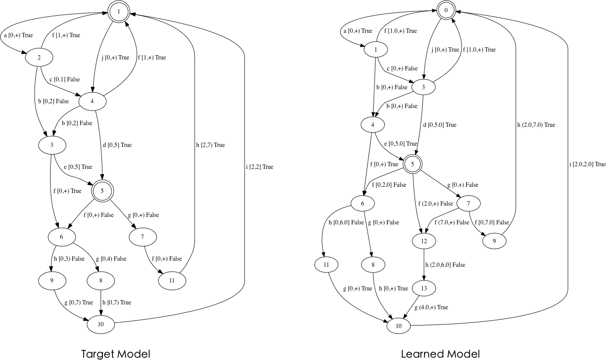

# PAC Learning of DOTAs

Developer: [WeiShen](https://github.com/MrEnvision)    Last updated: 2020.04.26

## Overview

This tool is dedicated to learning deterministic one-clock timed automata (DOTAs) which is a subclass of timed automata with only one clock. In contrast to the white-box learning tool given in [OTALearning](https://github.com/Leslieaj/OTALearning), we focus on the challenge of PAC learning of timed automata, which is a black box system. This tool for learning DOTAs under more realistic assumptions within the framework of PAC learning. Membership queries and equivalence queries are realized via testing. In addition, to speed up the learning process, we integrate comparator into learning framework.

## Installation

The project was developed using Python3, and it can be loaded and evaluations can be run with little effort.  You only need to download the project, but there are a few prerequisites before running：

- Python3.7.* (or high)
- graphviz (used for drawing)

## Usage

```shell
$python3 main.py model.json precondition.json
```

1. `main.py` is the main file of the program.
2. `model.json` is a JSON file about the structure of the model. Although this is a black box learning tool, in the prototype stage, users can provide model structure files to model DOTAs  to be learned.
3. `precondition.json` is a JSON file that records information about the model that the user knows  in advance, as well as user-defined parameters.

**For example:**

1. model.json 

```json
{
    "states": ["1", "2"],
    "inputs": ["a", "b", "c"],
    "trans": {
        "0": ["1", "a", "[3,9)", "r", "2"],
        "1": ["1", "b", "[1,5]", "r", "2"],
        "2": ["1", "c", "[0,3)", "n", "1"],
        "3": ["2", "a", "(5,+)", "n", "1"],
        "4": ["2", "b", "(7,8]", "n", "1"],
        "5": ["2", "c", "(4,+)", "r", "1"]
    },
    "initState": "1",
    "acceptStates": ["2"]
}
```

*Explanation:*

- "states": the set of the name of locations;
- "inputs": the input alphabet;
- "trans": the set of transitions in the form `id : [name of the source location, input action, guards, reset, name of the target location];`
  - "+" in a guard means INFTY;
  - "r" means resetting the clock, "n" otherwise
- "initState": the name of initial location;
- "acceptStates": the set of the name of accepting locations.

2. precondition.json

```json
{
  "inputs": ["a", "b", "c"],
  "upperGuard": 10,
  "stateNum": 3,
  "epsilon": 0.005,
  "delta": 0.005
}
```

*Explanation:*

- “inputs”:  the set of input operations that the user knows;
- "upperGuard" and "stateNum": the maximum constant appearing in the clock constraints and the number of model states estimated by the user based on experience;
- “epsilon”: the error parameter;
- "delta": the confidence parameter.

> ⚠️⚠️⚠️ During use, you must ensure that the naming is correct and the content follows the prescribed format.

## Output

If we learn the target DOTA successfully, the final COTA will be drawn and displayed as a PDF file. Additionally, the total time, the number of tests, the number of equivalence query, and the number of membership query will also be given. 

> Considering the target model in the left picture below, the learned model is in the right picture with  error parameter 0.001 and  confidence parameter 0.001 under a fixed distribution.



## License

See [MIT LICENSE](./LICENSE) file.

## Contact

Please let me know if you have any questions 👉 [EnvisionShen@gmail.com](mailto:EnvisionShen@gmail.com)